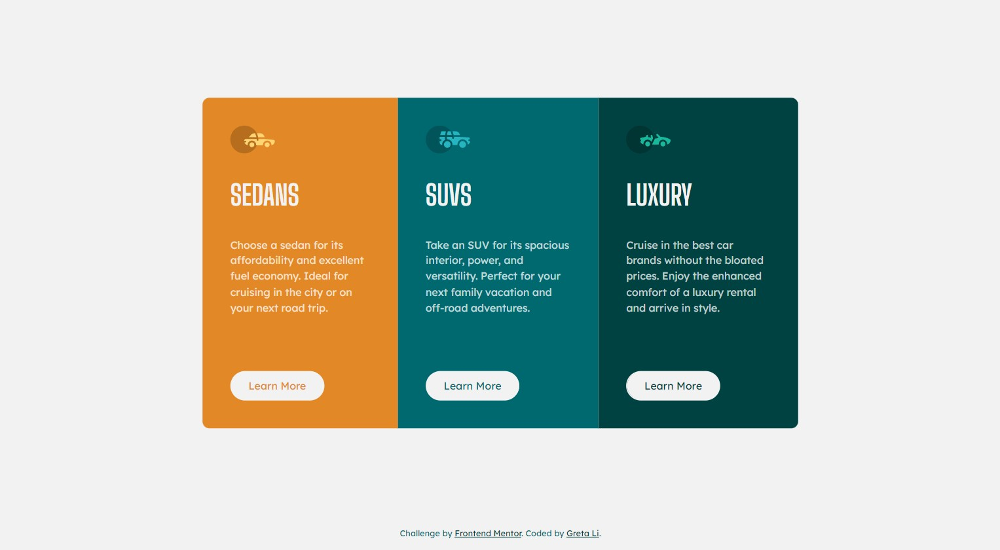

# Frontend Mentor - 3-column preview card component solution

This is a solution to the [3-column preview card component challenge on Frontend Mentor](https://www.frontendmentor.io/challenges/3column-preview-card-component-pH92eAR2-). Frontend Mentor challenges help you improve your coding skills by building realistic projects.

## Table of contents

- [Overview](#overview)
  - [The challenge](#the-challenge)
  - [Screenshot](#screenshot)
  - [Links](#links)
- [My process](#my-process)
  - [Built with](#built-with)
  - [What I learned](#what-i-learned)
- [Author](#author)

## Overview

### The challenge

Users should be able to:

- View the optimal layout depending on their device's screen size
- See hover states for interactive elements

### Screenshot



### Links

- Solution URL: [Repository](https://github.com/GretaLi/Frontend-Mentor-Challenge/tree/main/3-column-preview-card-component-main)
- Live Site URL: [3 column preview card component](https://gretali.github.io/Frontend-Mentor-Challenge/3-column-preview-card-component-main/)

## My process

### Built with

- Semantic HTML5 markup
- CSS custom properties
- Flexbox

### What I learned

Currently learning the design style and CSS property. Obviously, it's not really necessary in a one-page mini-project, but it's good for me to practice and learn how it works. :)

```html
<ul class="prod flex flex-column">
  <li class="flow bg-org">
    
    <h2 class="ff-display fs-500 fw-700 text-gray uppercase">Sedans</h2>
    <p class="ff-300">
      Choose a sedan for its affordability and excellent fuel economy. Ideal for
      cruising in the city or on your next road trip.
    </p>
    <a href="#" class="btn text-org">Learn More</a>
  </li>
  ....
</ul>
```

```css
:root {
  /* colors */
  --crl-org: 31 77% 52%;
  --crl-cyan: 184 100% 22%;
  --crl-darkCyan: 179 100% 13%;
  --crl-white: 0 0% 100% / 0.75; /* (paragraphs) */
  --crl-gray: 0 0% 95%; /* (background, headings, buttons) */

  /* font-sizes */
  --fs-500: 2.5rem;
  --fs-400: 1.25rem;
  --fs-300: 0.938rem;

  /* font-families */
  --ff-deca: "Lexend Deca", sans-serif; /* 400 */
  --ff-display: "Big Shoulders Display", cursive; /* 700 */
}
```

## Author

- Website - [Greta Li](https://github.com/GretaLi)
- Frontend Mentor - [@Greta Li](https://www.frontendmentor.io/profile/GretaLi)
