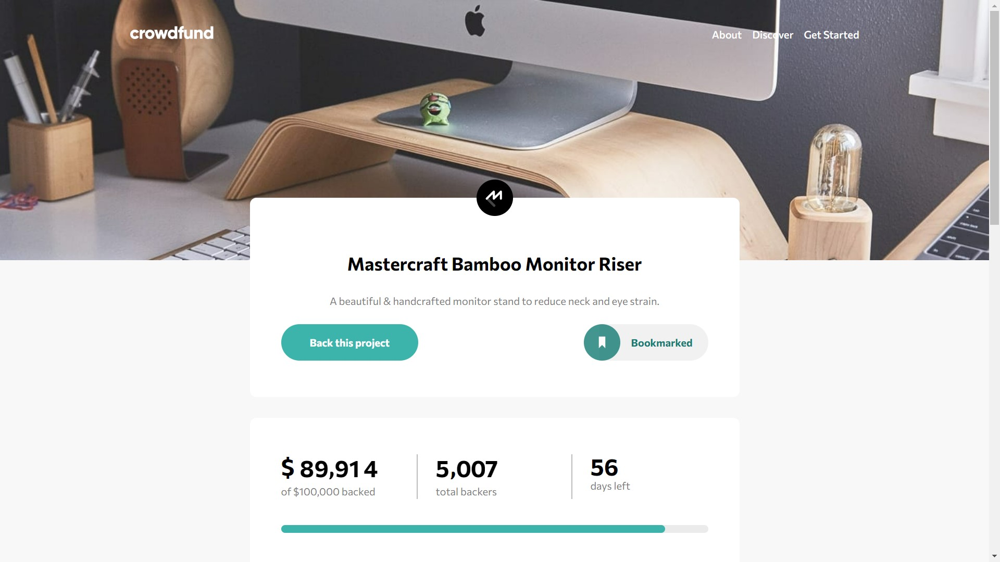
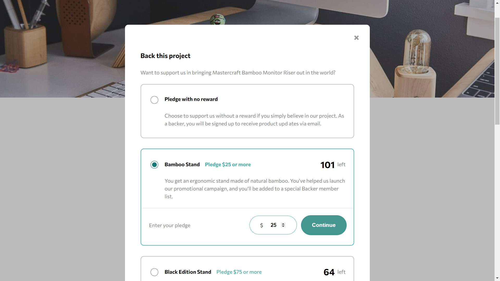
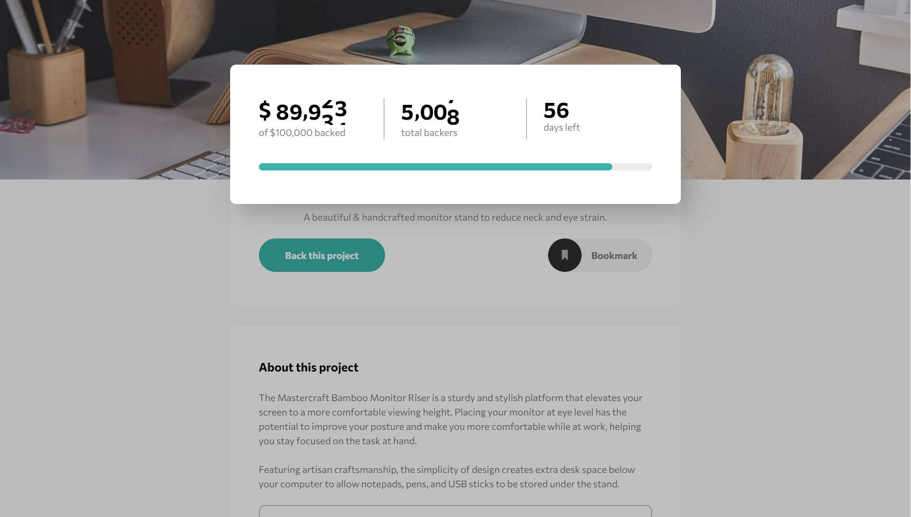
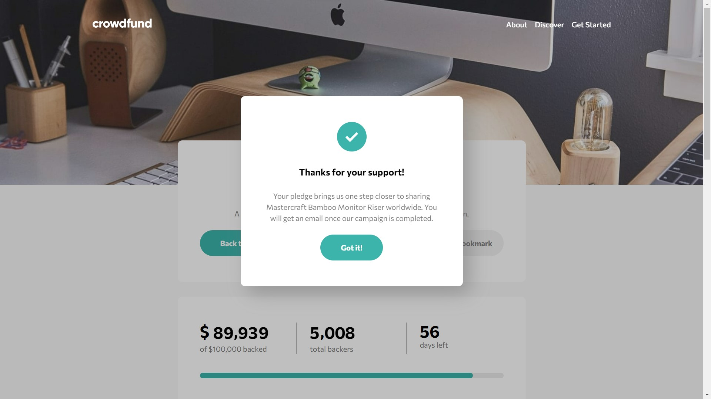

# Frontend Mentor - Crowdfunding product page solution

This is a solution to the [Crowdfunding product page challenge on Frontend Mentor](https://www.frontendmentor.io/challenges/crowdfunding-product-page-7uvcZe7ZR). Frontend Mentor challenges help you improve your coding skills by building realistic projects.

## Table of contents

- [Overview](#overview)
  - [The challenge](#the-challenge)
  - [Screenshot](#screenshot)
  - [Links](#links)
- [My process](#my-process)
  - [Built with](#built-with)
  - [What I learned](#what-i-learned)
  - [Continued development](#continued-development)
  - [Useful resources](#useful-resources)
- [Author](#author)

## Overview

### The challenge

Users should be able to:

- View the optimal layout depending on their device's screen size
- See hover states for interactive elements
- Make a selection of which pledge to make
- See an updated progress bar and total money raised based on their pledge total after confirming a pledge
- See the number of total backers increment by one after confirming a pledge
- Toggle whether or not the product is bookmarked

### Screenshot






### Links

- Solution URL: [Repository](https://github.com/GretaLi/Frontend-Mentor-Challenge/tree/main/Cowdfunding-product-page-main)
- Live Site URL: [Cowdfunding Product Page](https://gretali.github.io/Frontend-Mentor-Challenge/Cowdfunding-product-page-main/)

## My process

### Built with

- Semantic HTML5 markup
- CSS custom properties
- Flexbox
- Mobile-first workflow
- Javascript
- [jQuery](https://jquery.com/) - JS library

### What I learned

In this challenge, I spent a lot of time on card selection and manipulating the datas.

Although the code still could be more concise, I'm really happy to see how it truns out in the end. :D

#### **[ Selection ]**

**There different situation when click on card selection.**

1. When click on unavailable card...

   → no action

2. When click on target card...

   → remove below 3 settings from all cards as default

   → add "selected" class

   → check input radio

   → expand pledge aria

3. When click on target input radio...

   → remove below 3 settings from all cards as default

   → check input radio

   → add "selected" class

   → expand pledge aria

_Notes: HTML Attribute settings for each card..._

- `role="selectCard"` (use for manipulating card - itself)
- `aria-controls=""` (use for manipulating pledge aria)
- `data-controls=""` (use for manipulating input radio)

---

**Use event delegation to add different listener execute on Selection Modal**

```js
//Event Delegation
selectModal.addEventListener("click", selectStyle, false);

function selectStyle(e) {
  // when click on unavailable card...
  if (e.target.classList.contains("unavailable")) {
    return;
  } else {
    // when click on target card...
    if (e.target.getAttribute("role") == "selectCard") {
      let targetCard = e.target;
      removeSelectCard();
      selectCard(targetCard);
    }

    // when click on target input radio...
    if (e.target.getAttribute("name") === "select") {
      let targetCardDataControls = e.target.getAttribute("id");
      let targetCard = document.querySelector(
        `[data-controls='${targetCardDataControls}']`
      );
      removeSelectCard();
      selectCard(targetCard);
    }

    // when click on close btn...
    if (e.target.getAttribute("id") === "selectCloseBtn") {
      selectModal.style.display = "none";
      bgContainer.classList.remove("bg-shade");
      removeSelectCard();
    }
  }
}
```

**Remove Selected Status Function**

```js
function removeSelectCard() {
  // 0. remove below 3 settings
  let cards = document.querySelectorAll("[role='selectCard']");
  cards.forEach((card) => card.classList.remove("selected"));

  let radios = document.querySelectorAll("[name='select']");
  radios.forEach((radio) => (radio.checked = false));

  let pledges = document.querySelectorAll("[role='selectPledge']");
  pledges.forEach((pledge) => pledge.setAttribute("data-visible", false));
}
```

**Select Card Function**

```js
function selectCard(targetCard) {
  // 1. add "selected" class
  targetCard.classList.add("selected");

  // 2. check input radio
  let targetRaidoId = targetCard.getAttribute("data-controls");
  let targetRaido = document.querySelector([`#${targetRaidoId}`]);
  targetRaido.checked = true;

  // 3. expand pledge aria
  let targetPledgeId = targetCard.getAttribute("aria-controls");
  let targetPledge = document.querySelector([`#${targetPledgeId}`]);
  targetPledge.setAttribute("data-visible", true);
}
```

#### **[ Data Display ]**

**After submit the form, check which plan the user selected...**

Part I

0. check which plan is sebmited
1. check if input number is valid
2. display data
3. close selection modal

Part II

4. pop out data card
5. show success modal
6. return data card

_Notes: HTML button onclick function..._

- `button`
- `type="submit"`
- `onclick="return selectFunction(pledgeInput_1, dataStockLeft_1, pledgeStockLeft_1, 'validNum_1')"`

---

**Part I**

```js
function selectFunction(inputAmount, dataStockLeft, pledgeStockLeft, validNum) {
  // 0. if select Bamboo Stand...
  if (validNum === "validNum_1") {
    let maxNum = 75;
    let minNum = 25;

    // 1. check if input number is valid
    if (inputAmount.value > maxNum || inputAmount.value < minNum) {
      return;
    } else {
      dataDisplay(".odometer_amount", ".odometer_backer");
      submitFunciton();
    }
  }

  // 0.  if select Black Edition Stand...
  else if (validNum === "validNum_2") {
    let maxNum = 200;
    let minNum = 75;

    if (inputAmount.value > maxNum || inputAmount.value < minNum) {
      return;
    } else {
      dataDisplay(".odometer_amount", ".odometer_backer");
      submitFunciton();
    }
  }

  // 0. if select Mahogany Special...
  else if (validNum === "validNum_3") {
    let maxNum = 999;
    let minNum = 200;

    if (inputAmount.value > maxNum || inputAmount.value < minNum) {
      return;
    } else {
      dataDisplay(".odometer_amount", ".odometer_backer");
      submitFunciton();
    }
  }

  // 0.  if select Pledge with no reward...
  else if (validNum === "validNum_0") {
    let currentBacker = parseInt(dataBacker);
    currentBacker++;
    while (dataBacker <= 10000) {
      dataBacker++;
      break;
    }
    numberAnimation(".odometer_backer", currentBacker);
    submitFunciton();
  }

  // 2. display data
  function dataDisplay(item1, item2) {
    // item1 | prod-data--amount // +
    inputAmount = inputAmount.value;
    let currentAmount = parseInt(dataAmount) + parseInt(inputAmount);
    let currentProgress = currentAmount;
    numberAnimation(item1, currentAmount);

    while (dataAmount <= 100000) {
      dataAmount += parseInt(inputAmount);
      console.log("current amount: " + dataAmount);
      console.log("increse amount: " + (parseInt(dataAmount) - 89914));
      break;
    }

    // item2 | prod-data--backers // ++
    let currentBacker = parseInt(dataBacker);
    currentBacker++;
    numberAnimation(item2, currentBacker);

    while (dataBacker <= 10000) {
      dataBacker++;
      break;
    }

    // data | stok left // --
    let currentStock = dataStockLeft.innerHTML;
    currentStock = parseInt(currentStock);
    currentStock--;
    dataStockLeft.innerHTML = currentStock;

    pledgeStockLeft.innerHTML = currentStock;

    // data | prod-data--progressbar_current // width%
    currentProgress = (currentProgress / 100000) * 100;
    progressBar.style.width = currentProgress + "%";
  }

  // 3. close selection modal
  function closeSelecModal() {
    selectModal.style.display = "none";
    bgContainer.classList.remove("bg-shade");
    removeSelectCard();
  }
}
```

**Part II**

(jQuery)

```js
// 4. pop out data card
function dataPop(card) {
  $(bgContainer).addClass("bg-shade");
  $(card).addClass("shadow").addClass("dataCardPop");
  $("html,body").animate({ scrollTop: 100 });
  $(card).fadeIn(3000).delay(3000).fadeOut("slow");
}
// 5. show success modal
setTimeout(() => {
  successModal.style.display = "block";
}, 4000);
// 6. return data card
setTimeout(() => dataBack(dataCard), 4000);
function dataBack(card) {
  $(card).show();
  $(card).removeClass("dataCardPop");
  $(card).removeClass("shadow");
}
```

**Number Animation**

```js
function numberAnimation(item, num) {
  var odometer = new Odometer({
    el: $(item)[0],
    value: 1234,
    theme: "minimal",
    duration: 3000,
  });
  odometer.render();
  $(item).text(num);
}
```

### Useful resources

- [Number odometer animation](https://codepen.io/jimut/pen/aNwEbG)

## Author

- Website - [Greta Li](https://github.com/GretaLi)
- Frontend Mentor - [@Greta Li](https://www.frontendmentor.io/profile/GretaLi)
