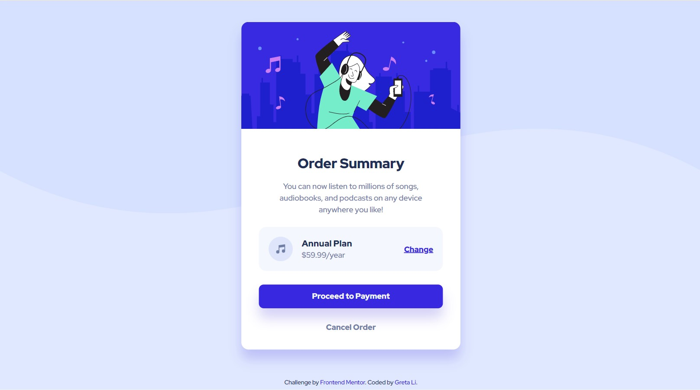

# Frontend Mentor - Order summary card solution

This is a solution to the [Order summary card challenge on Frontend Mentor](https://www.frontendmentor.io/challenges/order-summary-component-QlPmajDUj). Frontend Mentor challenges help you improve your coding skills by building realistic projects.

## Table of contents

- [Overview](#overview)
  - [The challenge](#the-challenge)
  - [Screenshot](#screenshot)
  - [Links](#links)
- [My process](#my-process)
  - [Built with](#built-with)
  - [What I learned](#what-i-learned)
  - [Useful resources](#useful-resources)
- [Author](#author)

## Overview

### The challenge

Users should be able to:

- See hover states for interactive elements

### Screenshot



### Links

- Solution URL: [Repository](https://github.com/GretaLi/Frontend-Mentor-Challenge/tree/main/Order-summary-component-main)
- Live Site URL: [Order summary component](https://gretali.github.io/Frontend-Mentor-Challenge/Order-summary-component-main/)

## My process

### Built with

- Semantic HTML5 markup
- CSS custom properties
- SCSS color variables
- Flexbox

### What I learned

**RWD - Horizontal Mobile Screen**

- This is my fourth challenge on Frontend Mentor, not until now did I notice that the card might NOT be inside a horizontal mobile screen.
- To prevent my card area out of the mobile screen, at the meanwhile stay at the center by using `flex`, I set `min-height: 95vh` to achieve this goal.
- Leave some paddings while screen is smallar than card width (450px).

```html
<div class="container">
  <div class="card">...</div>
</div>
```

```css
.container {
  min-height: 95vh;
  display: flex;
  justify-content: center;
  align-items: center;
  padding: 16px;
}
```

### Useful resources

- Thanks to [Vijay Bhati](https://www.frontendmentor.io/solutions/html-and-css-_c5fQe4uQN#feedback), I learned `min-height` when I was checking the comments on Frontend Mentor. I'm so glad this community really helps my learning journey. :)

## Author

- Website - [Greta Li](https://github.com/GretaLi)
- Frontend Mentor - [@Greta Li](https://www.frontendmentor.io/profile/GretaLi)
