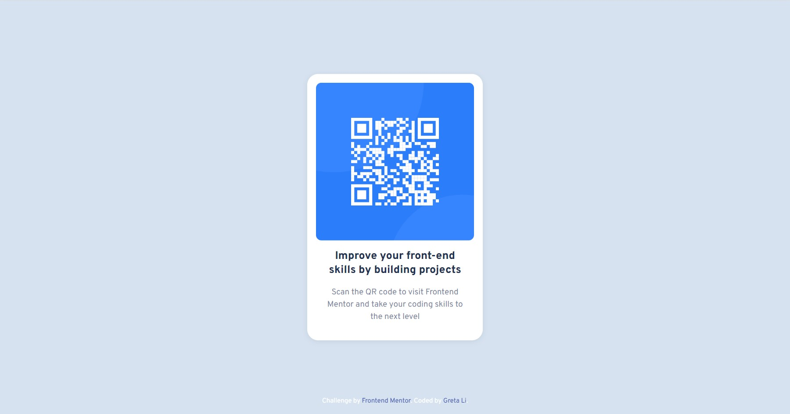

# Frontend Mentor - QR code component solution

This is a solution to the [QR code component challenge on Frontend Mentor](https://www.frontendmentor.io/challenges/qr-code-component-iux_sIO_H). Frontend Mentor challenges help you improve your coding skills by building realistic projects.

## Table of contents

- [Overview](#overview)
  - [Screenshot](#screenshot)
  - [Links](#links)
- [My process](#my-process)
  - [Built with](#built-with)
- [Author](#author)

## Overview

### Screenshot

### Links

- Solution URL: [Repository](https://github.com/GretaLi/Frontend-Mentor-Challenge/tree/main/Qr-code-component-main)
- Live Site URL: [QR code component](https://gretali.github.io/Frontend-Mentor-Challenge/Qr-code-component-main/)

## My process

### Built with

- Semantic HTML5 markup
- CSS/SCSS custom properties

## Author

- Website - [Greta Li](https://github.com/GretaLi)
- Frontend Mentor - [@Greta Li](https://www.frontendmentor.io/profile/GretaLi)
