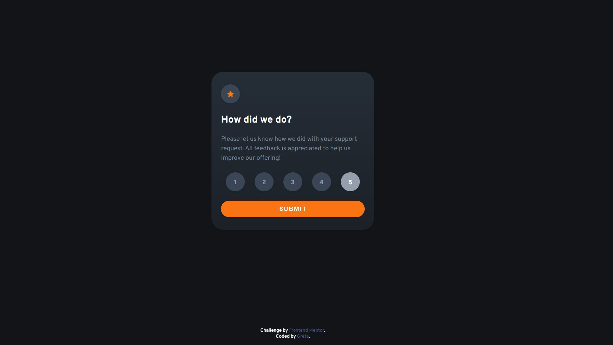
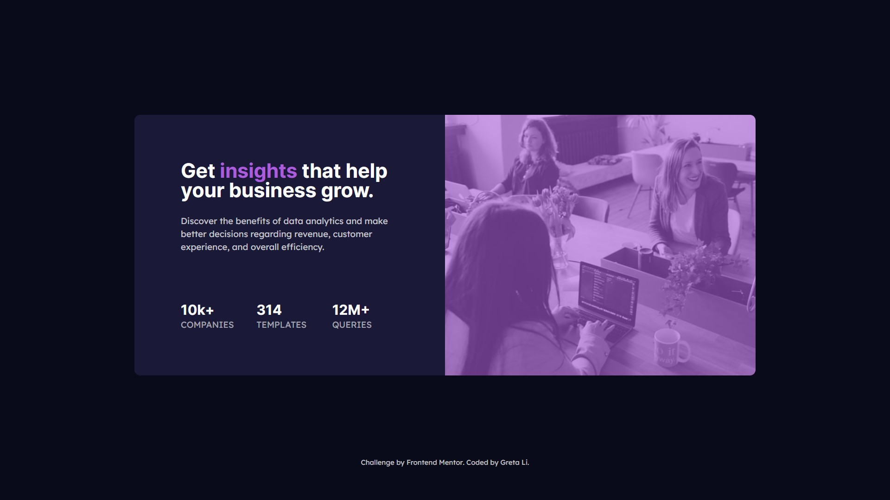

# Frontend-Mentor-Challenge

## Space tourism website solution

[Code](./Space-tourism-website-main) |
[Page](https://gretali.github.io/Frontend-Mentor-Challenge/Space-tourism-website-main/index.html)

Users should be able to:

- View the optimal layout for each of the website's pages depending on their device's screen size
- See hover states for all interactive elements on the page
- View each page and be able to toggle between the tabs to see new information
- Web Accessibility

## Crowdfunding product page solution

[Code](.Cowdfunding-product-page-main) |
[Page](https://gretali.github.io/Frontend-Mentor-Challenge/Cowdfunding-product-page-main/)

- Users should be able to:
- View the optimal layout depending on their device's screen size
- See hover states for interactive elements
- Make a selection of which pledge to make
- See an updated progress bar and total money raised based on their pledge total after confirming a pledge
- See the number of total backers increment by one after confirming a pledge
- Toggle whether or not the product is bookmarked

## Todo App

[Code](./Todo-app-main) |
[Page](https://gretali.github.io/Frontend-Mentor-Challenge/Todo-app-main/)

Users should be able to:

- View the optimal layout for the app depending on their device's screen size
- See hover states for all interactive elements on the page
- Add new todos to the list
- Mark todos as complete
- Delete todos from the list
- Filter by all/active/complete todos
- Clear all completed todos
- Toggle light and dark mode

## Intro section with dropdown navigation solution

[Code](./Intro-section-with-dropdown-navigation-main) |
[Page](https://gretali.github.io/Frontend-Mentor-Challenge/Intro-section-with-dropdown-navigation-main)

Users should be able to:

- View the relevant dropdown menus on desktop and mobile when interacting with the navigation links
- View the optimal layout for the content depending on their device's screen size
- See hover states for all interactive elements on the page

## 3-column preview card component solution

[Code](./3-column-preview-card-component-main) |
[Page](https://gretali.github.io/Frontend-Mentor-Challenge/3-column-preview-card-component-main/)

Users should be able to:

- View the optimal layout depending on their device's screen size
- See hover states for interactive elements

## Article preview component solution

[Code](./Article-preview-component-master) |
[Page](https://gretali.github.io/Frontend-Mentor-Challenge/Article-preview-component-master)

Users should be able to:

- View the optimal layout for the component depending on their device's screen size
- See the social media share links when they click the share icon

## Interactive rating component solution

[Code](./interactive-rating-component-main) |
[Page](https://gretali.github.io/Frontend-Mentor-Challenge/interactive-rating-component-main/)

Users should be able to:

- View the optimal layout for the app depending on their device's screen size
- See hover states for all interactive elements on the page
- Select and submit a number rating
- See the "Thank you" card state after submitting a rating

## Social proof section solution

[Code](./Social-proof-section-master) |
[Page](https://gretali.github.io/Frontend-Mentor-Challenge/Social-proof-section-master)

Users should be able to:

- View the optimal layout for the section depending on their device's screen size

## NFT preview card component solution

[Code](.NFT-preview-card-component-main) |
[Page](https://gretali.github.io/Frontend-Mentor-Challenge/NFT-preview-card-component-main)

Users should be able to:

- View the optimal layout depending on their device's screen size
- See hover states for interactive elements

## Order summary card solution

[Code](./Order-summary-component-main) |
[Page](https://gretali.github.io/Frontend-Mentor-Challenge/Order-summary-component-main/)

Users should be able to:

- See hover states for interactive elements

## Product preview card component solution

[Code](./Product-preview-card-component-main) |
[Page](https://gretali.github.io/Frontend-Mentor-Challenge/Product-preview-card-component-main/)

Users should be able to:

- View the optimal layout depending on their device's screen size
- See hover and focus states for interactive elements

## Stats preview card component solution

[Code](./Stats-preview-card-component-main) |
[Page](https://gretali.github.io/Frontend-Mentor-Challenge/Stats-preview-card-component-main/)

Users should be able to:

- View the optimal layout depending on their device's screen size

## Profile card component solution

[Code](./profile-card-component-main) |
[Page](https://gretali.github.io/Frontend-Mentor-Challenge/profile-card-component-main/)

Users should be able to:

- Build out the project to the designs provided

## QR code component solution

[Code](./Qr-code-component-main) |
[Page](https://gretali.github.io/Frontend-Mentor-Challenge/Qr-code-component-main/)
