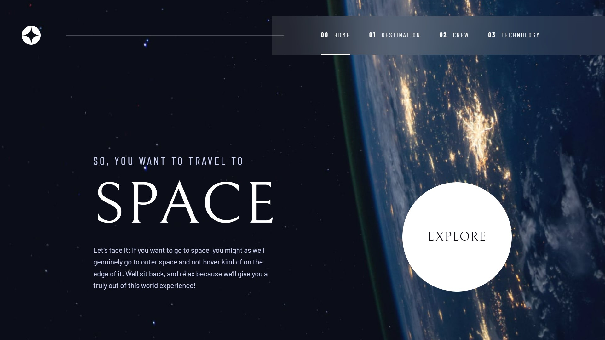

# Frontend Mentor - Space tourism website solution

This is a solution to the [Space tourism website challenge on Frontend Mentor](https://www.frontendmentor.io/challenges/space-tourism-multipage-website-gRWj1URZ3). Frontend Mentor challenges help you improve your coding skills by building realistic projects.

## Table of contents

- [Overview](#overview)
  - [The challenge](#the-challenge)
  - [Screenshot](#screenshot)
  - [Links](#links)
- [My process](#my-process)
  - [Built with](#built-with)
  - [What I learned](#what-i-learned)
    - [Font Size](#Font-Size-@media)
    - [Mobile Navigation](#mobile-nav-&-mobile-nav-toggle)
    - [@supports (special syntax)](#瀏覽器特定語法相容性)
    - [Grid](#grid)
    - [Some Extra Points](#some-extra-points)
    - [JS - HTML Attributes Setting](#js---html-attributes-setting)
    - [JS - Navigation](#js---navigation)
    - [JS - Keyboard Navigation](#js---tabs---keyboard-navigation)
    - [JS - Change Content](#js---tabs---change-content)
    - [JS - Syntaxt Used](#js---syntaxt-used)
  - [Useful resources](#useful-resources)
- [Author](#author)
- [Acknowledgments](#acknowledgments)

## Overview

### The challenge

Users should be able to:

- View the optimal layout for each of the website's pages depending on their device's screen size
- See hover states for all interactive elements on the page
- View each page and be able to toggle between the tabs to see new information

### Screenshot



### Links

- Solution URL: [Repository](https://github.com/GretaLi/Frontend-Mentor-Challenge/tree/main/Space-tourism-website-main)
- Live Site URL: [Space Tourism Website](https://gretali.github.io/Frontend-Mentor-Challenge/Space-tourism-website-main/index.html)

## My process

### Built with

- Semantic HTML5 markup
- CSS custom properties
- Flexbox
- Mobile-first workflow
- Javascript

### What I learned

_Below are my [class](https://scrimba.com/learn/spacetravel) notes and some points I've learned during the whole process._

#### **Font Size @media**

- Font Size Properties
  找出手機的字級並代入 --fs-200 ~ --fs-900

  - Breakpoint

    - 600px (Tablet)
    - 992px (Desktop)

  ```css
  /* font-sizes */
  --fs-900: clamp(5rem, 12vw + 1rem, 9.375rem); SPACE
  --fs-800: 3.5rem; MOON
  --fs-700: 1.5rem; DOUGLAS
  --fs-600: 1rem; COMMANDER
  --fs-550: 1.75rem; 384,00 KM
  --fs-500: 1rem; SO, YOU WANT..., numbered-title
  --fs-450: 1rem; nav
  --fs-400: 0.938rem; body
  --fs-300: 0.875rem; tab, THE TERMINOLOGY...
  --fs-200: 0.875rem; AVG. DISTANCE
  ```

- Font Size Properties @media(min-width: 600px)
  找出平板的字級並代入 --fs-200 ~ --fs-900

  ```css
  /* font-sizes */
  --fs-800: 5rem;
  --fs-700: 2.5rem;
  --fs-600: 1.5rem;
  --fs-500: 1.25rem;
  --fs-450: 0.875rem;
  --fs-400: 1rem;
  --fs-300: 1rem;
  ```

- Font Size Properties @media(min-width: 992px)
  找出桌機的字級並代入 --fs-200 ~ --fs-900

  ```css
  /* font-sizes */
  --fs-800: 6.25rem;
  --fs-700: 3.5rem;
  --fs-600: 2rem;
  --fs-500: 1.75rem;
  --fs-450: 1rem;
  --fs-400: 1.125rem;
  --fs-300: 1rem;
  ```

- 統整方法: 用 Figma 複製出每個字級依照大小以及手機、平板、桌機三種類型進行分類

- `--fs-900: clamp(5rem, 10vw + 1rem, 9.375rem)` 文字伸縮 (最小值, 伸縮基準 + 伸縮值, 最大值)

- `max-width: 50ch`用字元數限制寬度

- `padding-bottom: max(6rem, 20vh)` 最小 6rem 最大不超過 20vh

#### **mobile-nav & mobile-nav-toggle**

- `.mobile-nav` 的 CSS 寫在 `@media(max-width: 35rem)` 因此只會在小於 35rem 時套用
- `.mobile-nav` 要用 `position: fixed` 而非 `position: absolute` 才不會超出邊界產生空白
- `.navbar-toggle[aria-expanded="true"]{ background: url(...); }` 更換按鈕 icon
- `.navbar[data-visible="true"]{ transform: translateX(0)}` 控制導覽列滑出
- 動畫 `.7s ease-in-out`
- `inset: 0 0 0 30%;` top, right, bottom, left 簡寫
- `<script src="./....js" defer></script>` JS 載入 defer 屬性。瀏覽器載入程式碼時 js 最後才會執行，如果不寫，js 又放在 `<head>` 會載入失敗

#### **瀏覽器特定語法相容性**

`@supports (特定語法){ 如果瀏覽器相容其語法則執行 }`

```css
@supports (backdrop-filter: blur(1rem)) {
  backdrop-filter: blur(81.5485px);
}
```

#### **Grid**

- .grid-container
- `palce-item`
- `align-item`
- `grid-template-area` 設定 grid 區域名稱 & `grid-area` 指定區域

  ```css
  .grid-container--destination {
    --flow-space: 2rem;
    grid-template-areas:
      "title"
      "image"
      "tabs"
      "content";
  }

  .grid-container--destination > img {
    grid-area: image;
    max-width: 60%;
  }

  .grid-container--destination > .tab-list {
    grid-area: tabs;
  }

  .grid-container--destination > .destination-info {
    grid-area: content;
  }
  ```

#### **Some Extra Points**

- 調整結構 | Destination

  ```html
  <article>
    <h2>Moon</h2>
    <p>See our...</p>

    <div class="flex">
      <div>
        <h3>Av. distance</h3>
        <p>384,400 km</p>
      </div>
      ....
    </div>
  </article>
  ```

- flow | Article 中 h2 h3 p 的間隔

  ```html
  <article class="crew-details flow">
    <header class="flow flow--space-small">
      <h2>Commander</h2>
      <!-- <h3> mt .75rem -->
      <h3>Douglas</h3>
    </header>
    <!-- <p> mt 1rem -->
    <p>...</p>
  </article>
  ```

  ```css
  .flow > *:where(:not(:first-child)) {
    margin-top: var(--flow-space, 1rem);
  }

  .flow--space-small {
    --flow-space: 0.75rem;
  }
  ```

- 在 Screen Reader 上隱藏裝飾性文字

  ```html
  <span aria-hidden="true">01</span>
  ```

- `align-content: start` | 所有內容靠上排好

- 圖片效能改善 | 瀏覽器如支援 .webp 將會以 .webp 為優先

  ```html
  <picture>
    <source srcset="assets/destination/image-moon.webp" type="image/webp" />
    <source srcset="assets/destination/image-moon.avif" type="image/avif" />
    <!--本專案中沒有 .avif 可以不用加上-->
    
  </picture>
  ```

  - 記得把 css 中用到 `img` 的地方換成 `picture`

- Pesudo element `::before` `::after` don't work on `img` element.

- .webp 圖片檔案比 jpg 和 png 都來的小，是 Web Dev 未來趨勢

- `hidden` 屬性可以將 element 從畫面上藏起來
  ```html
  <picture hidden></picture>
  <article hidden></article>
  ```

#### **JS - HTML Attributes Setting**

- The HTML attributes should be set for JS.
- SR = Screen Reader 無障礙網頁

_Mobile Navigation_

- header > nav > ul

  - `id="primary-navigation"` 對應到按鈕的 aira-controls
  - `data-visible="false"` 自定義屬性，設定 mobile-nav 初始狀態

- header > nav > ul > li > span (for decoration)

  - `aria-hidden="true"` SR 不需要念出裝飾性文字

_Mobile Navigation | Toggler_

- header > button

  - `aria-controls="primary-navigation"` 對應到 nav 的 id

- header > button > span{Menu}

  - `class="sr-only"` SR 需要唸出此按鈕的功能
  - `aria-expanded="false"` SR 控制按鈕開關，預設為 false，且能用來更變按鈕 icon

_Tabs | parent_

- main

  - `id="main"`

_Tabs | tab list_

- main > div

  - `role="tablist"` 監聽事件時需要取得 role 的元件
  - `aria-label="crew member list"` SR 需要唸出頁籤列
    的功能

- main > div > button

  - `role="tab"` 監聽事件時需要取得 role 的元件
  - `aria-selected="true"` SR 知道目前開啟狀況
  - `aria-controls="commander-tabs"` 對應到 content 的 id
  - `data-image="commander-image"` 對應到 picture 的 id
  - `tabindex="0"` 鍵盤控制下，當前頁籤的 index 初始為 0
  - `tabindex="-1"` 鍵盤控制下，非當前頁籤的 index 皆為-1

- mian > div > button > span {The commander} (頁籤無文字時需設置)

  - `class="sr-only"`

_Tabs | tab content_

- main > article

  - `role="tabpanel"` 監聽事件時需要取得 role 的元件
  - `id="commander-tab"` 對應到 tab 的 aria-controls
  - `tabindex="0"` 鍵盤控制下，當前頁籤的 index 初始為 0
  - `tabindex="-1"` 鍵盤控制下，非當前頁籤的 index 皆為-1
  - `hidden` 非當前頁籤的 content 隱藏

_Tabs | tab picture_

- mian > picture
  - `id="commander-image"` 對應到 tab 的 data-image

#### **JS - Navigation**

```js
const nav = document.querySelector(".primary-navigation");
// 選取 .primary-navigation，並設變數 nav 賦予其值
const navToggle = document.querySelector(".mobile-nav-toggle");
// 選取 .mobile-nav-toggle，並設變數 navToggle 賦予其值

navToggle.addEventListener("click", () => {
  // 滑鼠點擊按鈕時發生監聽事件
  const visiblity = nav.getAttribute("data-visible");
  // 取得導覽列能判斷開啟或關閉狀態的的屬性，並設變數 visiblity 賦予其值
  if (visiblity === "false") {
    // 條件式判斷 visiblity 為關閉，當滑鼠 click 時，設定 nav 屬性 data-visible 為開啟
    nav.setAttribute("data-visible", true);
    // 條件式判斷 visiblity 為關閉，當滑鼠 click 時，設定 navToggle 屬性 aria-expanded 為開啟
    navToggle.setAttribute("aria-expanded", true);
  } else {
    // 否則，當滑鼠 click 時，設定 nav 屬性 data-visible 為關閉
    nav.setAttribute("data-visible", false);
    // 否則，當滑鼠 click 時，設定 navToggle 屬性 aria-expanded 為關閉
    navToggle.setAttribute("aria-expanded", false);
  }
});
```

```css
.primary-navigation[data-visible="true"] {
  transform: translateX(0);
} /*導覽列滑進視窗*/
.mobile-nav-toggle[aria-expanded="true"] {
  background-image: url(./assets/shared/icon-close.svg);
} /*切換按鈕 icon*/
```

#### **JS - Tabs - Keyboard Navigation**

```js
// Tab List
const tabList = document.querySelector('[role="tablist"]');
// 選取屬性 [role="tablist"]，並設變數 tabList 賦予其值
const tabs = tabList.querySelectorAll('[role="tab"]');

// Tab List - keydown focus
// 選取屬性 [role="tab"]，並設變數 tabs 賦予其值
tabList.addEventListener("keydown", changeTabFocus);
// 鍵盤按下導覽列時發生監聽事件，並執行函數 changeTabFocus

// Tab List - click each tab
tabs.forEach((tab) => {
  tab.addEventListener("click", changeTabPanel);
  // tabs 陣列中用 .forEach 選取所有的 [role="tab"] 並執行以 tab 為參數的函數 => 滑鼠點擊取出的 tab 時發生監聽事件，並執行函數 changeTabPanel
});

// Tab List - keydown focus function
let tabFocus = 0;
// tabFocus 賦予初始值為零，作為 tabs 的 [index] 使用
function changeTabFocus(e) {
  // 函數 changeTabFocus 執行事件e
  const keydownLeft = 37;
  const keydownRight = 39;
  // console.log(e.keyCode); 得知鍵盤左右鍵的代碼

  // ! 當按下鍵盤右鍵或左鍵時，更改當前 tab 的 tabindex 數字為 -1
  if (e.keyCode === keydownLeft || e.keyCode === keydownRight) {
    tabs[tabFocus].setAttribute("tabindex", -1);
    // ↑方法一: 條件式判斷鍵盤按下左鍵或右鍵並執行函數，設定當前 tab 的屬性 "tabindex" 為-1
    tabs.forEach((tab) => {
      tab.setAttribute("tabindex", -1);
    });
    // ↑方法二: 條件式判斷鍵盤按下左鍵或右鍵並執行函數，設定當所有 tab 的屬性 "tabindex" 為-1，函式最後會再把當前的變成 0
  }

  // ! 當按下鍵盤右鍵 focus 右移一格 (index 索引)
  if (e.keyCode === keydownRight) {
    // 條件式判斷鍵盤按下右鍵，tab 的 [index] 數字 +1
    tabFocus++;

    // ! 當 focus 到最後一個 tab 時，再按下右鍵會跳至第一個
    if (tabFocus >= tabs.length) {
      // 條件式判斷鍵盤按下右鍵，tab 的 [index] 數字大於或等於 tabs 總長度時，[index] 歸零
      tabFocus = 0;
    }
  }
  //! 當按下鍵盤左鍵時 focus 左移一格 (index 索引)
  if (e.keyCode === keydownLeft) {
    tabFocus--;
    // ! 當 focus 到第一個 tab 時，再按下左鍵會跳至最後一個
    if (tabFocus < 0) {
      tabFocus = tabs.length - 1;
    }
  }
  // ! 當前所在的 tab 設定 tabindex 為 0
  // ! 當前所在的 tab 要以 focus 選取
  tabs[tabFocus].setAttribute("tabindex", 0);
  tabs[tabFocus].focus();
}
// 備註: tabindex = "0"  || tabindex="-1" 兩種情況 ，tabindex 在這裡主要為 SR 所用，即使沒有設定鍵盤控制 focus 照樣可以執行
```

#### **JS - Tabs - Change Content**

```js
// Tab List - click each tab function
// ! 點擊 tab 時
function changeTabPanel(e) {
  const targetTab = e.target;
  // click event 的目標節點，並設變數 targetTab 賦予其值
  const targetPanel = targetTab.getAttribute("aria-controls");
  // 取得目標 tab 的 aria-controls 屬性，並設變數 targetPanel 賦予其值
  const targetImage = targetTab.getAttribute("data-image");
  // 取得目標 tab 的 data-image 屬性，並設變數 targetImage 賦予其值
  const tabContainer = targetTab.parentNode;
  // 取得目標 tab 的父層節點，並設變數 tabContainer 賦予其值 (為使js可以用在不同專案，而不直接選特定 element)
  const mainContainer = tabContainer.parentNode;
  // 取得 tabContainer 的父層節點，並設變數 mainContainer 賦予其值

  // ! 將所有含屬性 [aria-selected="true"] 改成 false
  tabContainer
    .querySelector('[aria-selected="true"]')
    .setAttribute("aria-selected", false);
  // 取得含有屬性 [aria-selected="true"] 的 element，並更改其屬性為 false

  // ! 將目標 tab 的 aria-selected 屬性改成 true
  targetTab.setAttribute("aria-selected", true);

  // ! 將所有 main 中含屬性 [role="tabpanel"] 的 element，用 hidden 屬性隱藏
  mainContainer
    .querySelectorAll('[role="tabpanel"]')
    .forEach((panel) => panel.setAttribute("hidden", true));

  // ! 將 main 中 id 為 targetPanel 的 element，移除 hidden 屬性
  mainContainer.querySelector(`#${targetPanel}`).removeAttribute("hidden");

  // ! 將所有 main 中的 picture element，用 hidden 屬性隱藏
  mainContainer
    .querySelectorAll("picture")
    .forEach((picture) => picture.setAttribute("hidden", true));

  // ! 將 main 中 id 為 targetIage 的 element，移除 hidden 屬性
  mainContainer.querySelector([`#${targetImage}`]).removeAttribute("hidden");

  // console.log(mainContainer);
}

// 規則: 先隱藏所有，再顯示特定
```

#### **JS - Syntaxt Used**

- `.querySelector("選取元素")` 元素選取器(只選第一筆資料)
- `.querySelector("選取元素")` 元素選取器(全部筆資料)
- `.addEventListener("事件", function)` 監聽事件並執行函數
- `.setAttribute("屬性名稱", 值)` 設定屬性的值
- `.getAttribute("屬性名稱")` 取得屬性的值
- `.removeAttribute("屬性名稱")` 移除屬性
- `.parentNode;` 取得父層節點
- `forEach((參數) =>{ 參數.執行 })`
- `.querySelector([`#${變數}`])`

### Useful resources

- [scrollbar-gutter](https://developer.mozilla.org/en-US/docs/Web/CSS/scrollbar-gutter) - 視窗卷軸預留空位
- [grid-container](https://b-l-u-e-b-e-r-r-y.github.io/post/Grid/) - grid 格線系統補充
- [hidden](https://developer.mozilla.org/en-US/docs/Web/HTML/Global_attributes/hidden) - HTML hidden attribute 只要元素有設置 display，hidden 隱藏就會無效

## Author

- Website - [Greta Li](https://github.com/GretaLi)
- Frontend Mentor - [@Greta Li](https://www.frontendmentor.io/profile/GretaLi)

## Acknowledgments

I've learned a lot from the teacher, Kevin. Especially, design system, modern CSS syntax and Javascript.

Highly recommend [Scrimba's free course](https://scrimba.com/learn/spacetravel) for building this Space Tourism Website! :)
