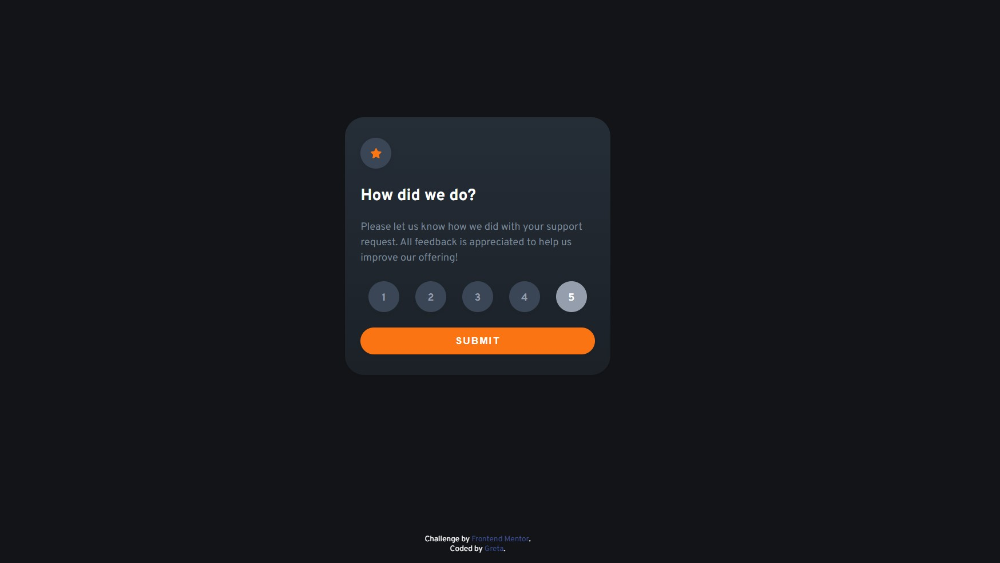

# Frontend Mentor - Interactive rating component solution

This is a solution to the [Interactive rating component challenge on Frontend Mentor](https://www.frontendmentor.io/challenges/interactive-rating-component-koxpeBUmI). Frontend Mentor challenges help you improve your coding skills by building realistic projects.

## Table of contents

- [Overview](#overview)
  - [The challenge](#the-challenge)
  - [Screenshot](#screenshot)
  - [Links](#links)
- [My process](#my-process)
  - [Built with](#built-with)
  - [What I learned](#what-i-learned)
  - [Useful resources](#useful-resources)
- [Author](#author)

## Overview

### The challenge

Users should be able to:

- View the optimal layout for the app depending on their device's screen size
- See hover states for all interactive elements on the page
- Select and submit a number rating
- See the "Thank you" card state after submitting a rating

### Screenshot



### Links

- Solution URL: [Repository](https://github.com/GretaLi/Frontend-Mentor-Challenge/tree/main/interactive-rating-component-main)
- Live Site URL: [Interactive rating component](https://gretali.github.io/Frontend-Mentor-Challenge/interactive-rating-component-main/)

## My process

### Built with

- HTML5
- SCSS custom properties
- SCSS variable for colors
- Flexbox
- Mobile-first workflow
- [jQuery](https://jquery.com/) - JS library

### What I learned

**How to stay on the same page after clicking submit button in a form?**

_WAS_

- Add a `ifram` right after `form` and add `target` on `form` tag.

```html
<form target="iframe_to_remain_same_page">...</form>
<iframe id="id_iframe" name="iframe_to_remain_same_page" style="display:none;">
</iframe>
```

_NOW_

- Thanks to [@Gwenaël Magnenat](https://www.frontendmentor.io/solutions/interactive-rating-component-solution-using-jquery-5Ryt4NM1u0#comment-62a8b10fd6026920fcb4fcb9), I learned another method to prevent form redirection.
- So I remove above `ifram` and use `e.preventDefault()` to avoid page refreshing after submission.

```js
$("form").submit(function (e) {
  e.preventDefault();
  $(".rating").hide();
  $(".success").show().animate({
    opacity: "1",
  });
  return;
});
```

**How to print the content by using `.text()` method?**

- I originally declared an array `const points = [1, 2, 3, 4, 5]` to get the point numbers.
- With [@Gwenaël Magnenat](https://www.frontendmentor.io/solutions/interactive-rating-component-solution-using-jquery-5Ryt4NM1u0#comment-62a8b10fd6026920fcb4fcb9)'s inspiration, now I change to use `attr("value")` to print the actual value.

_WAS_

```js
// output rating
const points = [1, 2, 3, 4, 5];
$(".btn-rate").click(function () {
  let i = $(this).index();
  $("#output").text(`${points[i]} `);
});
```

_NOW_

```js
// output rating
const points = $("input[name='rate']");
$(".btn-rate").click(function () {
  let i = $(this).index();
  let print = $(points[i]).attr("value");
  $("#output").text(`${print} `);
});
```

**How to fade in the hiding area and overlay the previous one?**

- Instead of suddenly popping out, I attempt to use jQuery `.show()` and `.animate()` method , from `opacity:0` to `opacity: 1`, to fade in the success area.

```js
$("form").submit(function () {
  $(".rating").hide();
  $(".success").show().animate({
    opacity: "1",
  });
  return;
});
```

### Useful resources

- [jQuery: animate](https://api.jquery.com/animate/)

## Author

- Website - [Greta Li](https://github.com/GretaLi)
- Frontend Mentor - [@Greta Li](https://www.frontendmentor.io/profile/GretaLi)
